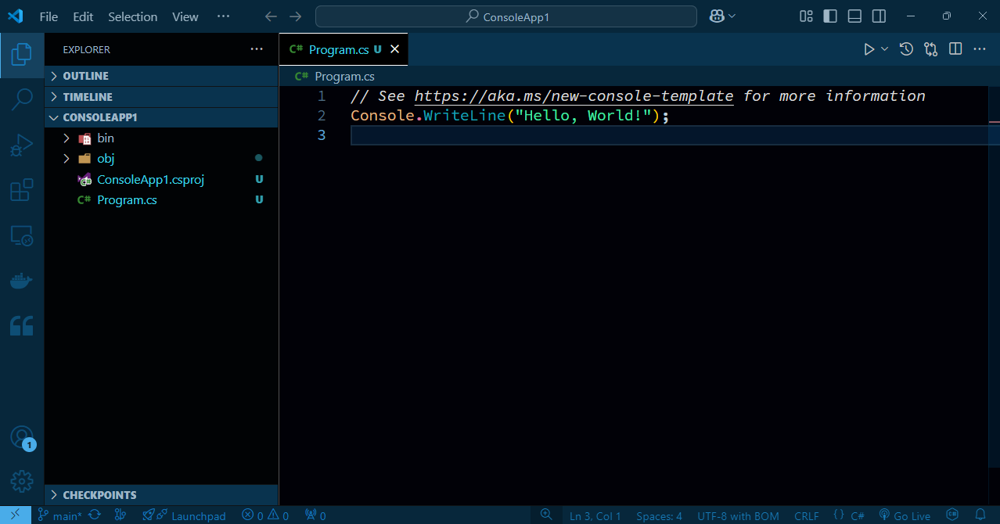
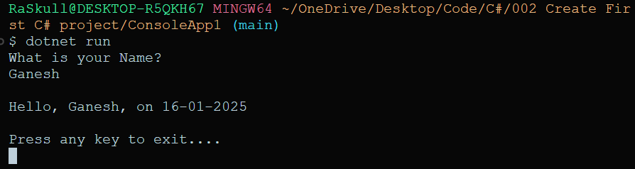

`CTRL + SHIFT + P` => `.NET new project` => `Console App`  => give the name to app  
##### Preview:  
  

`Program.cs: `  
```C#
Console.WriteLine("What is your Name?");
var name = Console.ReadLine();
var curDate = DateTime.Now;
Console.WriteLine($"{Environment.NewLine}Hello, {name}, on {curDate:d}");
Console.WriteLine($"{Environment.NewLine}Press any key to exit....");
Console.ReadKey(true);
```  
```bash
dotnet run
```  
##### Preview:  
  