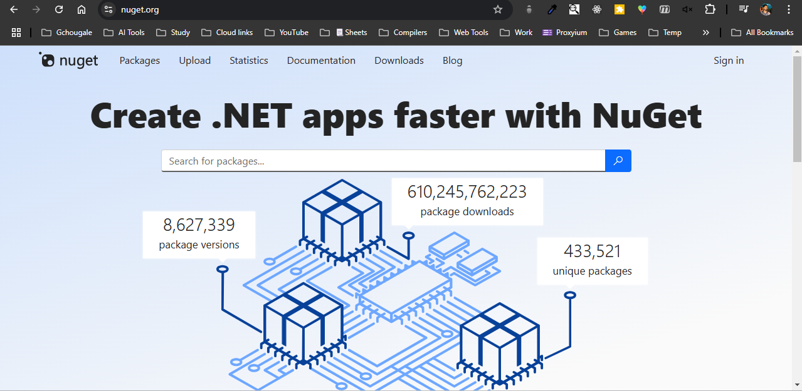
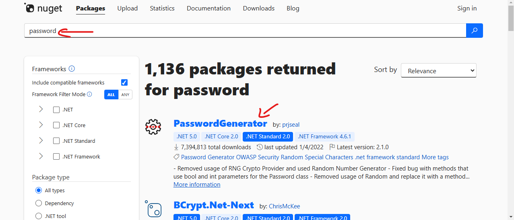
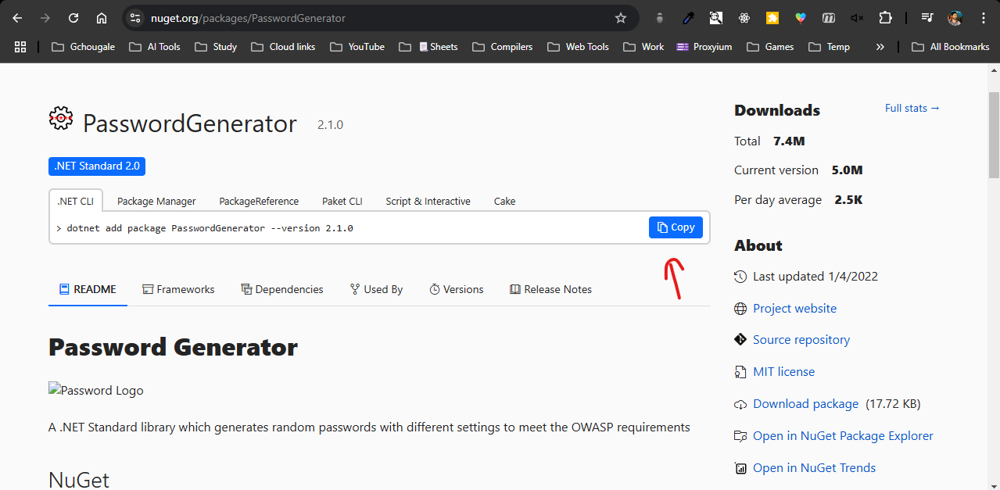
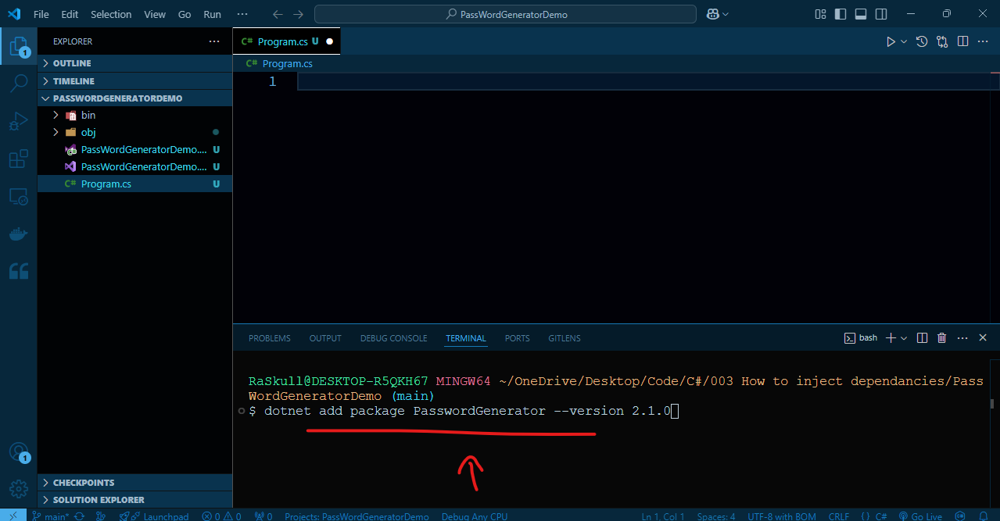
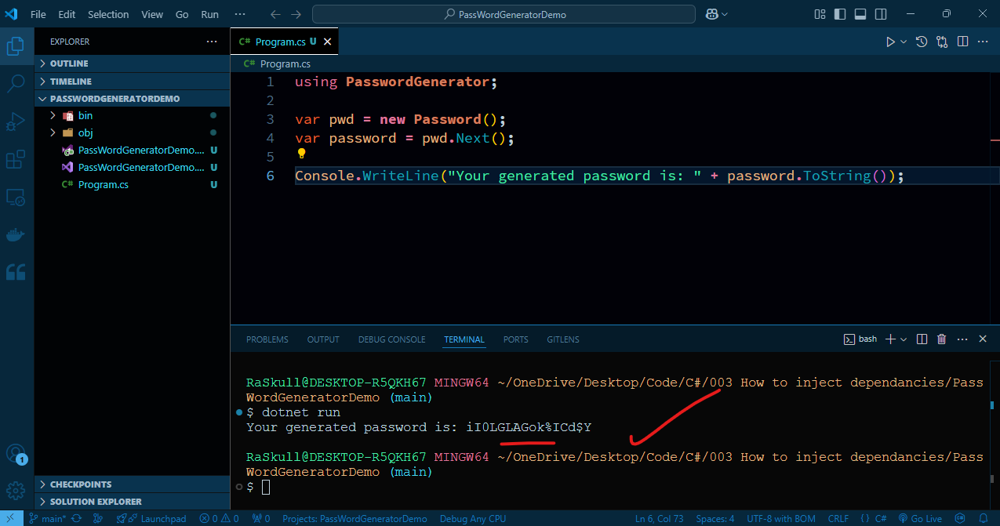

url = `https://www.nuget.org/`  
##### Preview:  
  
search the dependancy you want to inject, then enter  
##### Preview:  
  
open the dependancy page & copy the command  
##### Preview:  
  
then paste it in project home terminal & ENTER  
##### Preview:  
  
```C#
using PasswordGenerator;

var pwd = new Password();
var password = pwd.Next();

Console.WriteLine("Your generated password is: " + password.ToString());
```  
##### Preview:  
  